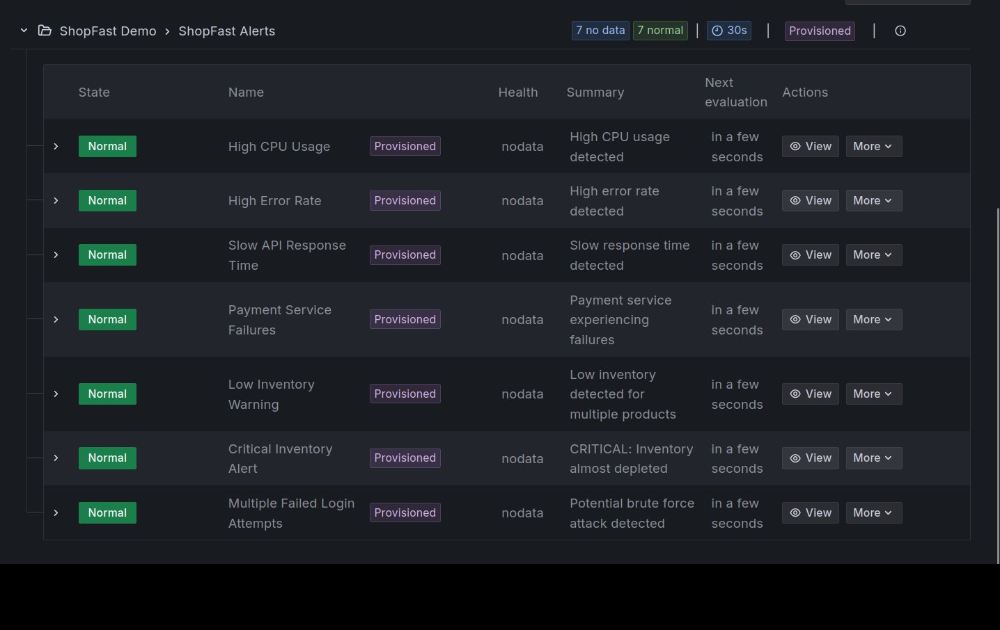

# ShopFast - Grafana Observability Demo

Complete Grafana observability demonstration with real-world e-commerce scenarios. Showcases **metrics** (Prometheus), **logs** (Loki), **traces** (Tempo), and **alerting** across all data sources - with full correlation!

```
╔════════════════════════════════════════════════════════════╗
║        🚀 ShopFast Simulation Control Center 🚀           ║
╚════════════════════════════════════════════════════════════╝

Choose a simulation scenario to trigger Grafana alerts:

💡 TIP: Press 'q' or '10' to exit | Option '1' to view stock levels

1) 📊 View Current Stock Levels
2) 🟢 Normal Traffic (baseline - no alerts)
3) ⚡ Flash Sale (triggers LOW INVENTORY alert)
4) 💳 Payment Failures (triggers LOG-BASED alert)
5) 🔒 Security Breach (triggers DATABASE alert)
6) 🔥 High CPU Usage (triggers METRICS alert)
7) 📦 Low Inventory (gradual depletion)
8) 🎯 Run ALL Scenarios (complete demo)
9) 🔧 Rebuild Docker Image
10) ❌ Exit

Select scenario (1-10, or 'q' to quit): 3

Available Products:
  1. Gaming Laptop (Stock: 50)
  2. Wireless Mouse (Stock: 150)
  3. Mechanical Keyboard (Stock: 75)
  ...

Select Product ID [1-10, default: 1]: 1
Duration in seconds [30]: 30

🚀 Running simulation: flash-sale
━━━━━━━━━━━━━━━━━━━━━━━━━━━━━━━━━━━━━━

Starting Flash Sale Simulation...
Duration: 30 seconds
Product: Gaming Laptop (ID: 1)
━━━━━━━━━━━━━━━━━━━━━━━━━━━━━━━━━━━━━━
Order #1: Gaming Laptop x2 ($2599.98) - Stock: 48 ✓
Order #2: Gaming Laptop x1 ($1299.99) - Stock: 47 ✓
Order #3: Gaming Laptop x3 ($3899.97) - Stock: 44 ✓
...
━━━━━━━━━━━━━━━━━━━━━━━━━━━━━━━━━━━━━━
✅ Simulation completed!

💡 TIP: Check Grafana → Alerting → Alert rules
   Look for 'Low Inventory Warning' alert
```

---

## Quick Start

```bash
# 1. Start services
docker compose up -d

# 2. Open Grafana (wait 30 seconds first)
# http://localhost:3000 (admin/admin)

# 3. Run the interactive simulator
./run-simulation.sh
# Choose a scenario from the menu and watch alerts fire!
```

**That's it!** No Python installation needed - everything runs in Docker.

---

## What's Included

**Observability Stack:**
- Grafana 12 - Dashboards and alerting
- **Alloy - Unified observability collector** ⭐ (metrics, logs, traces)
- Prometheus - Metrics storage
- Loki - Log storage
- Tempo - Trace storage
- PostgreSQL - Business database

> 🚀 **Why Alloy?** This demo showcases Grafana Alloy as a **true unified collector** for all three pillars of observability. Instead of multiple agents (Promtail for logs, Prometheus for metrics, separate trace collector), Alloy does it all! It collects metrics, logs, AND traces from your services and routes them to the appropriate backends (Prometheus, Loki, Tempo). This simplifies your architecture, reduces resource usage, and provides better visibility into your telemetry pipeline via the built-in UI.

> 🔍 **Complete Observability:** This demo showcases the **three pillars of observability**: metrics (Prometheus), logs (Loki), and **traces (Tempo)** - all correlated in Grafana for powerful debugging!

**Microservices:**
- API Service (8080) - Product catalog and orders
- Frontend Service (8081) - Web interface
- Payment Service (8082) - Payment processing
- Inventory Service (8083) - Stock monitoring

**7 Pre-Configured Alerts:**
| Alert | Type | Trigger |
|-------|------|---------|
| High CPU Usage | Prometheus | CPU > 70% for 1 min |
| High Error Rate | Prometheus | Errors > 10% for 2 min |
| Slow Response Time | Prometheus | p95 > 1s for 3 min |
| Payment Failures | Loki | > 5 errors in 5 min |
| Low Inventory | PostgreSQL | Stock ≤ threshold |
| Critical Inventory | PostgreSQL | Stock ≤ 5 units |
| Failed Logins | PostgreSQL | ≥ 5 attempts in 5 min |


---

## Requirements

- Docker Desktop or Docker Engine + Docker Compose
- 4GB RAM available
- Ports: 3000, 3200, 8080-8083, 9090, 3100, 4317, 4318, 5432, 12345

---

## 🔍 Distributed Tracing with OpenTelemetry

This demo includes **distributed tracing** to track requests across all microservices!

### What You Get

**Request Flow Visibility:**
- See the complete journey of a request from frontend → API → payment
- Identify bottlenecks and latency issues
- Track errors to the exact service and operation

**Automatic Instrumentation:**
- All services instrumented with OpenTelemetry
- Auto-traces HTTP requests, database queries, and service calls
- No manual span creation needed (but you can add custom spans!)

**Full Correlation:**
- 🔗 **Trace → Logs**: Click a trace span to see related logs
- 🔗 **Trace → Metrics**: Jump from trace to metrics at that timestamp
- 🔗 **Logs → Trace**: Find the trace for any log entry

### How to Use Traces

1. **Run a simulation** to generate requests:
   ```bash
   ./run-simulation.sh
   # Select any scenario (e.g., Flash Sale)
   ```

2. **Open Grafana** → **Explore** → Select **Tempo**

3. **Search for traces:**
   - Search by service: `service.name="api-service"`
   - Search by operation: `name="POST /api/orders"`
   - Or use TraceQL: `{ span.http.status_code = 500 }`

4. **Explore the trace:**
   - See timing breakdown across services
   - Click spans to view tags and logs
   - Click "Logs for this span" to jump to correlated logs
   - Click "View metrics" to see prometheus data

### Example: Order Processing Trace

```
Flash Sale Order Trace (Total: 450ms)
├─ Frontend: GET /checkout [120ms]
├─ API: POST /api/orders [280ms]
│  ├─ Database: SELECT products [45ms]
│  ├─ Database: INSERT orders [30ms]
│  └─ Payment: POST /api/payment/process [180ms] ⚠️ SLOW!
└─ Inventory: GET /api/inventory/status [50ms]
```

### Technical Details

**Stack:**
- **Instrumentation**: OpenTelemetry Python SDK (auto-instrumentation for Flask, psycopg2, requests)
- **Collection**: Grafana Alloy (OTLP receiver on ports 4317/4318)
- **Storage**: Grafana Tempo (local storage, 48h retention)
- **Visualization**: Grafana (with full correlation features)

**Architecture:**
```
Services (OTel SDK) → Alloy (OTLP) → Tempo → Grafana
```

---

## Running Simulations

### Interactive Menu

Simply run:

```bash
./run-simulation.sh    # Linux/Mac
run-simulation.bat      # Windows
```

You'll get a beautiful interactive menu:

```
╔════════════════════════════════════════════════════════════╗
║        🚀 ShopFast Simulation Control Center 🚀           ║
╚════════════════════════════════════════════════════════════╝

Choose a simulation scenario to trigger Grafana alerts:

💡 TIP: Press 'q' or '10' to exit | Option '1' to view stock levels

1) 📊 View Current Stock Levels
2) 🟢 Normal Traffic (baseline - no alerts)
3) ⚡ Flash Sale (triggers LOW INVENTORY alert)
4) 💳 Payment Failures (triggers LOG-BASED alert)
5) 🔒 Security Breach (triggers DATABASE alert)
6) 🔥 High CPU Usage (triggers METRICS alert)
7) 📦 Low Inventory (gradual depletion)
8) 🎯 Run ALL Scenarios (complete demo)
9) 🔧 Rebuild Docker Image
10) ❌ Exit

Select scenario (1-10, or 'q' to quit):
```

**What makes this special:**
- 📊 **View live stock levels** - Check inventory status anytime
- ⚡ **Organic traffic generation** - Simulates real requests over time (not instant)
- 🎯 **Interactive prompts** - Guides you through each scenario
- 🔧 **Built-in troubleshooting** - Rebuild option if simulator has issues
- 💡 **Helpful tips** - Shows where to check alerts in Grafana after each run

---

## Demo Control Panel

For **instant** inventory changes during live demos:

```bash
./demo-control.sh    # Linux/Mac
demo-control.bat      # Windows
```

Options:
- Reset to Default (50 units)
- Set High Stock (100 units)
- Set Near Threshold (15 units)
- **Trigger Alert NOW (8 units)** ⚡ Instant alert!
- View/Reset All Products
- Clear Orders

### When to Use Which Tool?

| Tool | Use Case | How It Works |
|------|----------|--------------|
| **run-simulation.sh** | Realistic demos, training | 🌊 **Organic**: Generates real HTTP requests over time (30-120s) |
| **demo-control.sh** | Quick tests, resets | ⚡ **Instant**: Direct database changes (triggers in 30s) |

**Pro Tips:**
- Use **run-simulation.sh** to show realistic traffic patterns and how alerts naturally fire
- Use **demo-control.sh** for quick resets between scenarios or when time is limited
- The simulation tool includes a **rebuild option** (Option 9) if you encounter any issues

---

## Architecture

```
┌─────────────┐
│   Grafana   │ ← Port 3000
└──────┬──────┘
       │
       ├────────────┬──────────┬──────────┬──────────┐
       │            │          │          │          │
┌──────▼─────┐ ┌───▼────┐ ┌──▼────┐ ┌───▼────┐ ┌──▼─────┐
│ Prometheus │ │  Loki  │ │ Tempo │ │Postgres│ │ Alloy  │
│   :9090    │ │ :3100  │ │ :3200 │ │ :5432  │ │ :12345 │
└──────┬─────┘ └────▲───┘ └───▲───┘ └───┬────┘ └────┬───┘
       │            │         │          │           │
       │      ┌─────┴─────────┴──────────┘           │
       │      │   Logs & Traces Collector            │
       │      │   (Ports 4317/4318 OTLP)             │
       │      │                                       │
       └──────┴───────────────────────────────────────┴───┐
                                                           │
       ┌───────────────────────────────────────────────────▼─┐
       │          Microservices (OTel Instrumented)          │
       │  API│Frontend│Payment│Inventory                     │
       │  8080  8081    8082   8083                          │
       └─────────────────────────────────────────────────────┘
```

**Data Flow (Unified via Alloy):**
- **Metrics**: Alloy scrapes services → forwards to Prometheus via remote write
- **Logs**: Services write to files → Alloy reads → forwards to Loki
- **Traces**: Services send OTLP to Alloy → Alloy forwards to Tempo

**Why This is Better:**
- ✅ Single collector agent (Alloy) for all telemetry
- ✅ Reduced resource footprint vs. multiple agents
- ✅ Centralized configuration and debugging via Alloy UI
- ✅ Better visibility into the collection pipeline

---

## Service URLs

| Service | URL | Credentials |
|---------|-----|-------------|
| Grafana | http://localhost:3000 | admin / admin |
| Prometheus | http://localhost:9090 | - |
| Loki | http://localhost:3100 | - |
| **Tempo** | **http://localhost:3200** | **-** |
| Alloy UI | http://localhost:12345 | - |
| API | http://localhost:8080/health | - |
| Frontend | http://localhost:8081/health | - |
| Payment | http://localhost:8082/health | - |
| Inventory | http://localhost:8083/health | - |

💡 **Explore Observability:**
- **Alloy UI** (http://localhost:12345): See component graph, collected logs/traces, and debug configuration
- **Grafana Explore**: Query traces in Tempo, click through to correlated logs and metrics!

---

## Complete Demo Flow (5 Minutes)

Perfect for presentations:

```bash
# 1. Start services
docker compose up -d
# Wait 60 seconds

# 2. Show Grafana
# Open http://localhost:3000
# Navigate to: Alerting → Alert rules

# 3. Run the interactive simulator
./run-simulation.sh
# Select: Option 3 (⚡ Flash Sale)
# Product: 1 (Gaming Laptop)
# Duration: 30 seconds

# 4. Watch alerts fire in Grafana
# The simulator generates organic traffic over 30 seconds
# Alert fires after evaluation period (30-60s total)
# Show: Low Inventory Warning alert

# 5. Reset for next demo
./demo-control.sh
# Select: 1 (Reset to Default)
```

💡 **Why this works so well:** The simulation tool generates realistic HTTP requests over time, showing how alerts naturally fire as inventory depletes - much more impressive than instant database changes!

---

## Troubleshooting

### Services won't start

```bash
docker compose down
docker compose up -d --force-recreate
```

### Simulator connection errors

```bash
# Check services are running
docker compose ps

# View logs
docker compose logs -f api-service

# If issues persist, rebuild the simulator image
./run-simulation.sh
# Then select Option 9 (Rebuild Docker Image)
```

### Alerts not firing

- Wait 30-60 seconds for evaluation
- Check alert "For" duration in Grafana
- Verify query returns data in Explore view

### Docker permission denied (Linux)

```bash
sudo usermod -aG docker $USER
newgrp docker
```

### PostgreSQL not ready

Wait 60 seconds on first startup. PostgreSQL takes time to initialize.

---

## Making Alerts Editable

Provisioned alerts are read-only by default. To make them editable:

```bash
# After first startup
docker compose stop grafana
mv grafana/provisioning/alerting/alerting.yml grafana/provisioning/alerting/alerting.yml.backup
docker compose start grafana
```

Now alerts are editable in the Grafana UI!

---

## Alert Query Examples

### Low Inventory (PostgreSQL)

```sql
SELECT name, stock_level 
FROM products 
WHERE stock_level <= low_stock_threshold
```

### Payment Failures (Loki)

```
sum(count_over_time({service="payment"} |~ "ERROR|payment failed" [5m])) > 5
```

### High CPU (Prometheus)

```
rate(process_cpu_seconds_total[1m]) > 0.7
```

---

## Database Access

### Via Grafana

1. Go to **Explore**
2. Select **PostgreSQL**
3. Run queries

### Via Command Line

```bash
docker exec -it shopfast-postgres psql -U shopfast -d shopfast
```

### Useful Queries

```sql
-- View current inventory
SELECT name, stock_level, low_stock_threshold 
FROM products 
ORDER BY stock_level ASC;

-- View recent orders
SELECT o.id, p.name, o.quantity, o.total_amount, o.order_time
FROM orders o
JOIN products p ON o.product_id = p.id
ORDER BY o.order_time DESC
LIMIT 10;

-- Check failed login attempts
SELECT email, COUNT(*) as attempts
FROM login_attempts 
WHERE success = false 
  AND attempt_time > NOW() - INTERVAL '5 minutes'
GROUP BY email;
```

See [DATABASE_SCHEMA.md](DATABASE_SCHEMA.md) for complete schema documentation.

---

## Customization

### Modify Alert Thresholds

Edit `grafana/provisioning/alerting/alerting.yml` or modify in Grafana UI (after making alerts editable).

### Add Notification Channels

Edit `grafana/provisioning/alerting/notification-channels.yml`:

```yaml
notifiers:
  - name: Slack
    type: slack
    settings:
      url: <your-webhook-url>
```

### Add Custom Metrics

Edit service code in `services/*/app.py` to expose new Prometheus metrics.

### Adjust Simulation Behavior

Edit `simulation/simulator.py` and rebuild:

```bash
docker rmi shopfast-simulator
./run-simulation.sh
```

---

## Cleanup

```bash
# Stop services (preserves data)
docker compose down

# Stop and remove all data
docker compose down -v

# Remove simulator image
docker rmi shopfast-simulator
```

### Migration Note

If you previously used this demo with Promtail, the old `loki/promtail-config.yml` file is no longer needed. The new Alloy configuration is in `alloy/config.alloy` using the modern River syntax.

---

## Platform Support

### Linux/Mac

```bash
docker compose up -d
./run-simulation.sh
./demo-control.sh
```

### Windows

```powershell
docker compose up -d
run-simulation.bat
demo-control.bat
```

Or use WSL/Git Bash for `.sh` scripts.

---

## How It Works

1. **Services start** via `docker-compose.yml`
2. **Grafana auto-provisions** data sources and alert rules
3. **Simulator generates traffic** via Dockerized Python script
4. **Services emit observability data:**
   - **Metrics** → Prometheus (scraped via /metrics endpoint)
   - **Logs** → Log files → Alloy → Loki
   - **Traces** → OpenTelemetry OTLP → Alloy → Tempo
5. **Alloy acts as collector** for logs and traces
6. **Grafana evaluates** alert rules every 30 seconds
7. **Alerts fire** when conditions are met
8. **Full correlation** available: traces ↔ logs ↔ metrics

---

## Use Cases

**Training & Education**
- Teach Grafana alerting concepts
- Demonstrate multi-source alerts
- Show alert configuration best practices

**Sales Demonstrations**
- Showcase Grafana capabilities
- Interactive customer presentations
- Realistic scenarios

**Conference Talks**
- Live demos with pre-configured scenarios
- Quick reset between presentations
- Reliable, reproducible results

See [TALK_NOTES.md](TALK_NOTES.md) for a complete presentation guide.

---

## Additional Documentation

- **[DATABASE_SCHEMA.md](DATABASE_SCHEMA.md)** - Complete database schema and queries
- **[TRACES.md](TRACES.md)** - Distributed tracing guide with examples and troubleshooting ⭐ NEW!
- **[TALK_NOTES.md](TALK_NOTES.md)** - Presentation script with timing and Q&A prep

---

## Key Features

✅ Zero Python setup - Simulator runs in Docker  
✅ Cross-platform - Works on Linux, Mac, Windows  
✅ Pre-configured - 7 alerts ready to demo  
✅ Interactive controls - Easy-to-use CLI menus  
✅ Multi-source alerts - Prometheus, Loki, PostgreSQL  
✅ **Distributed tracing** - OpenTelemetry + Tempo ⭐ NEW!  
✅ **Full correlation** - Traces ↔ Logs ↔ Metrics  
✅ Realistic scenarios - E-commerce use cases  
✅ Quick reset - Database control panel  

---

## Support

- Check this README for setup and usage
- Review logs: `docker compose logs -f`
- Check service health: `docker compose ps`

---

**Built for demonstrating Grafana alerting capabilities** 🚀
